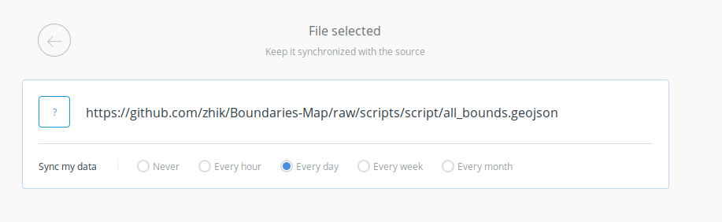
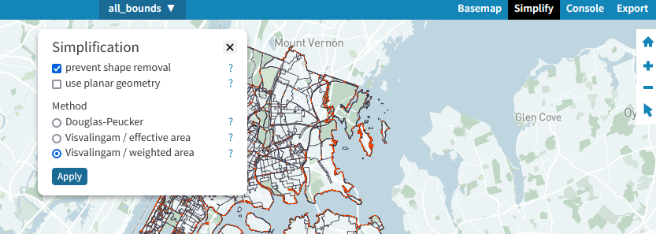
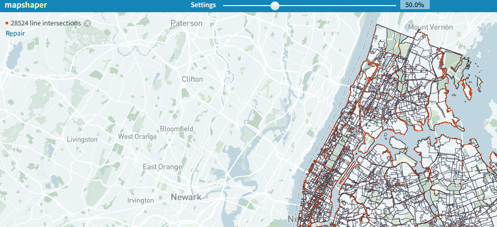
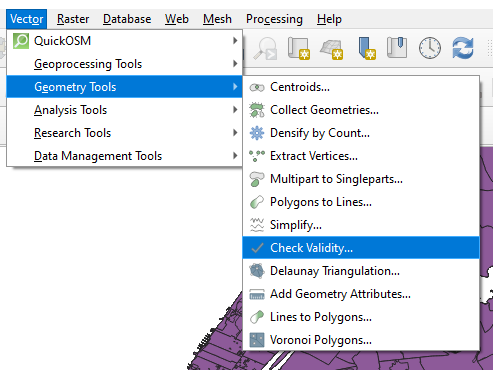
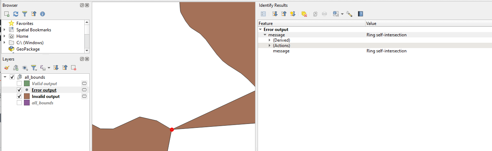
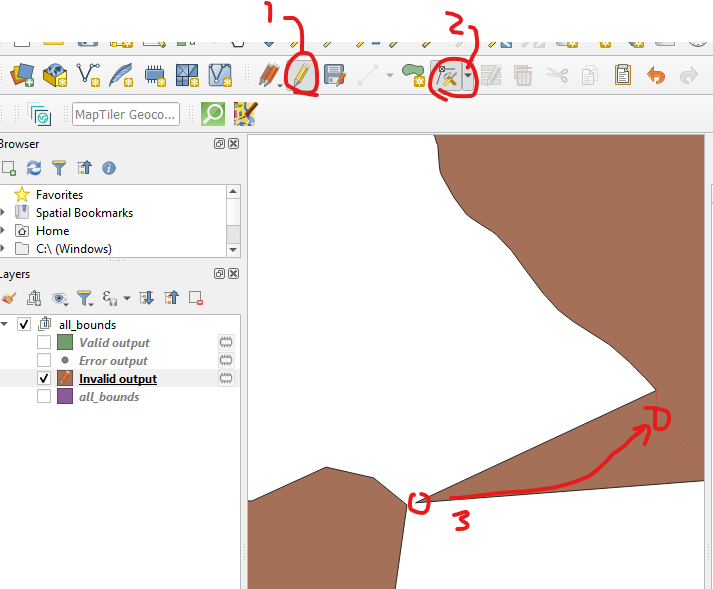

# Boundaries-Map Download and Merge Script

The NYC [Boundaries Map](https://betanyc.github.io/Boundaries-Map/) uses Carto to serve map tiles and run SQL queries. Maintaining over a handful of boundaries can be very time consuming, and costly for users querying many layers at a time.

This script will download all the datasets in the `data.json` file, then merge them to a single feature collection called `all_bounds.geojson`

The geojson will include the fields formatted to provide a quick way to query though all the various boundaries. All fields are a string.

| id  | nameCol | nameAlt              |
| --- | ------- | -------------------- |
| cd  | 101     |                      |
| cd  | 102     |                      |
| nta | 1       | Fresh Meadows-Utopia |
| sd  | BKN09   | 309                  |

To select one layer

```sql
SELECT * FROM all_bounds WHERE id = 'cd'
```

To find all boundaries of a given point

```sql
SELECT * FROM all_bounds WHERE ST_Intersects(ST_SetSRID(ST_MakePoint(long, lat), 4326),the_geom)
```

To find all intersect boundaries to a single bound (example uses Community District 101)

```sql
SELECT id, namecol, namealt FROM all_bounds, (SELECT the_geom FROM all_bounds WHERE id = 'cd' AND namecol = '101') as m WHERE ST_Intersects(all_bounds.the_geom, m.the_geom) AND (st_area(st_intersection(all_bounds.the_geom, m.the_geom))/st_area(all_bounds.the_geom)) > .00025
```

## How to run

- Add your datasets to `data.json`
- Download npm packages `npm install --dev`
- Clear the files folder `rm -rf files`
- Then `npm run start`

## Create or update import

The easiest way to create or import the geojson is directly on the Carto dashboard. Drag and drop the .geojson file.

### Syncing

Syncing a provides a way
Either commit your geojson to github and use the raw url; or upload geojson to file sharing service. Then paste it to the "Upload a file or a URL" text field and click submit.


Select your data sync frequency, then click connect your dataset.



Note you may also manually sync in the data view.

### Syncing Carto [Import API](https://carto.com/developers/import-api/reference/)

Carto Import API provides a mostly hands free method of updating your dataset. Then run the following command in your terminal.

```bash
curl -v -d '{"url":"https://github.com/{github_account}/Boundaries-Map/raw/master/script/all_bounds.geojson", "interval": 3600}' -H "Content-Type: application/json" "https://{carto_account}.carto.com/api/v1/synchronizations/?api_key={api_key}"
```

Using the id in the response you can check the status of your sync

```bash
curl -v "https://{carto_account}.carto.com/api/v1/synchronizations/{id}?api_key={api_key}"
```

Common issues are

- Unsupported/Unrecognized file type : check shapefile and geojson files in a GIS software
- Over account storage limit, please upgrade : you might be running the Free tier, and/or need to upgrade your Carto Account

### SQL Issues

After uploading and querying overlaps, you might encounter api queries that return 400 such as:

- You are over platform's limits: SQL query timeout error. Refactor your query before running again or contact CARTO support for more details.

This is due to either the polygons being too complex or invalid polygons that self intersect. I recommend you use [https://mapshaper.org/](mapshaper.org) to simplify upto 50%. Make sure to check prevent shape removal! Afterwards repair line intersections. This will take a bit of time (the page might freeze) since the all_bounds.geojson file is large.





Upload the simplified file into QGIS and run the check validity tool to fix invalid polygons manually. You can find the validity tool under Vector > Geometry Tools or search the Processing Toolbox. 

 

This will export three layers (Valid output, Invalid output, Error output). Hide the Valid output and put the Error output (points) over the Invalid output (polygons). Use the identify tool on the point layer to get details on what is wrong with the polygon. 

 

You can use the edit tool on the polygon to delete vertices to correct for those errors.
 

Lastly use the Merge Vector Layers tool under Vector > Data Management Tools to combine Valid output and Invalid output together. Export as geojson to replace the all_bounds.geojson in this folder.

View [https://www.youtube.com/watch?v=J3m-gzbLfCo](this video) for more details.


